# Event Storming AS-IS

## Process overview

Current complaint handling is mostly manual. Email, Excel, SAP and JIRA are disconnected. The service specialist acts as the integration layer between systems.

This creates delays, inconsistent classification and poor operational visibility.

## Actors

| Actor | Role |
|---|---|
| Customer | Sends complaint email with description and defect photos |
| Service Specialist | Reads emails, copies data, classifies defect, checks SAP and creates JIRA tickets |
| Quality Department | Receives correction tickets for confirmed defects |
| CEO / Management | Needs operational metrics and visibility |
| SAP ERP | Stores order, batch and production context |
| JIRA | Tracks complaints and corrections |
| Excel Register | Manual complaint register |

## Commands

Commands represent intentions or requests to perform an action.

- Send complaint email
- Read complaint email
- Register complaint in Excel
- Categorize defect
- Check order in SAP
- Check batch in SAP
- Create complaint ticket in JIRA
- Reply to customer
- Create correction ticket for Quality Department

## Domain Events

Events represent business facts that already happened.

- Complaint email received
- Complaint email missed or delayed
- Complaint data manually entered into Excel
- Defect category assigned manually
- Order data checked in SAP
- Batch data checked in SAP
- Complaint ticket created in JIRA
- Customer response sent
- Defect confirmed
- Correction ticket created for Quality Department

## External systems

- Microsoft 365 / Exchange mailbox
- Excel file: `Rejestr Reklamacji 2026.xlsx`
- SAP ERP PP/QM
- JIRA Cloud project `REK`

## Pain points

| Area | Problem | Business impact |
|---|---|---|
| Email intake | Emails may land in spam or be read late | Complaints start with delay |
| Manual entry | Data is copied into Excel | Errors and wasted specialist time |
| Classification | Category depends on specialist judgement | Poor consistency and weak reporting |
| SAP/JIRA disconnect | Manual lookup and ticket creation | Slow processing and no traceable flow |
| Reporting | Excel is not a reliable analytical layer | CEO lacks metrics by category, line and batch |
| Seasonal peaks | 80 complaints/day possible | Backlog grows to 2–3 days |

## Diagram

```mermaid
---
title: Metalpol AS-IS Event Storming Process Map
config:
  layout: dagre
  theme: base
  themeVariables:
    fontFamily: Inter, Segoe UI, Helvetica, Arial
    primaryColor: "#FFFFFF"
    primaryTextColor: "#1E293B"
    primaryBorderColor: "#94A3B8"
    lineColor: "#475569"
    clusterBkg: "#F8FAFC"
    clusterBorder: "#E2E8F0"
---
flowchart LR
    %% Professional Event Storming Color Palette Definitions
    classDef actor fill:#E0F2FE,stroke:#0284C7,stroke-width:2px,color:#0F172A
    classDef command fill:#BAE6FD,stroke:#0284C7,stroke-width:1.5px,color:#0C4A6E
    classDef event fill:#FED7AA,stroke:#EA580C,stroke-width:1.5px,color:#7C2D12
    classDef policy fill:#F3E8FF,stroke:#9333EA,stroke-width:1.5px,color:#581C87
    classDef system fill:#FEF08A,stroke:#CA8A04,stroke-width:1.5px,color:#713F12
    classDef pain fill:#FEE2E2,stroke:#EF4444,stroke-width:2px,color:#7F1D1D
    classDef decision fill:#FCE7F3,stroke:#DB2777,stroke-width:2px,color:#4C0519

    %% --- CUSTOMER AND INTAKE LAYER ---
    subgraph SubCustomer["1. Channel & Customer Intake"]
        CUST("Klient / Customer"):::actor
        CMD_SEND["Send complaint email"]:::command
        MAIL["System: Microsoft 365<br/>reklamacje@metalpol.pl"]:::system
        EVT_EMAIL_RECEIVED["Complaint email received"]:::event
        
        PAIN_SPAM["CRITICAL:<br/>~40% emails in spam<br/>or read with delay"]:::pain
    end

    %% --- MANUAL PROCESSING LAYER ---
    subgraph SubService["2. Manual Verification & Triage"]
        POL_CHECK_MAILBOX["Policy: Specialist checks<br/>mailbox manually"]:::policy
        EVT_EMAIL_READ["Complaint email read"]:::event
        EVT_EMAIL_DELAYED["Complaint email<br/>missed or delayed"]:::event

        CMD_EXCEL["Register complaint in Excel"]:::command
        EXCEL["System: Excel<br/>Rejestr Reklamacji 2026.xlsx"]:::system
        EVT_EXCEL["Complaint data manually<br/>entered into Excel"]:::event

        CMD_CLASSIFY["Categorize defect manually"]:::command
        EVT_CLASSIFIED["Defect category<br/>assigned manually"]:::event
        
        PAIN_CLASS["PAIN:<br/>Inconsistent categories<br/>between specialists"]:::pain
    end

    %% --- DATA ENRICHMENT LAYER ---
    subgraph SubSap["3. SAP ERP Enrichment"]
        CMD_CHECK_ORDER["Check order in SAP"]:::command
        SAP["System: SAP ERP PP/QM"]:::system
        EVT_ORDER_CHECKED["Order data checked in SAP"]:::event
        
        CMD_CHECK_BATCH["Check batch in SAP"]:::command
        EVT_BATCH_CHECKED["Batch data checked in SAP"]:::event
    end

    %% --- WORKFLOW AND ACTION LAYER ---
    subgraph SubJira["4. Records Creation & Resolution"]
        CMD_CREATE_COMPLAINT["Create Complaint ticket"]:::command
        JIRA["System: JIRA Cloud<br/>Project REK"]:::system
        EVT_COMPLAINT_CREATED["Complaint ticket<br/>created in JIRA"]:::event
        
        POL_CONFIRMED{"Policy:<br/>Defect confirmed?"}:::decision
        CMD_CREATE_CORRECTION["Create Correction ticket"]:::command
        EVT_CORRECTION_CREATED["Correction ticket<br/>created for Quality"]:::event
    end

    %% --- OUTPUT & VISIBILITY ---
    subgraph SubOutbound["5. Close-out & Reporting"]
        CMD_REPLY["Reply to customer"]:::command
        EVT_RESPONSE_SENT["Customer response sent"]:::event
        
        PAIN_SLA["PAIN:<br/>High SLA Time<br/>Avg response: 2 days"]:::pain
        PAIN_METRICS["MANAGEMENT PAIN:<br/>No reliable metrics<br/>(types, lines, backlog)"]:::pain
    end

    %% --- RELATIONSHIPS AND FLOW ---
    CUST --> CMD_SEND
    CMD_SEND --> MAIL
    MAIL --> EVT_EMAIL_RECEIVED
    MAIL -.-> PAIN_SPAM

    EVT_EMAIL_RECEIVED --> POL_CHECK_MAILBOX
    POL_CHECK_MAILBOX --> EVT_EMAIL_READ
    POL_CHECK_MAILBOX -.->|Unreliable path| EVT_EMAIL_DELAYED
    EVT_EMAIL_DELAYED -.-> PAIN_SLA

    EVT_EMAIL_READ --> CMD_EXCEL
    CMD_EXCEL --> EXCEL
    EXCEL --> EVT_EXCEL
    
    EVT_EXCEL --> CMD_CLASSIFY
    CMD_CLASSIFY --> EVT_CLASSIFIED
    EVT_CLASSIFIED -.-> PAIN_CLASS

    EVT_CLASSIFIED --> CMD_CHECK_ORDER
    CMD_CHECK_ORDER --> SAP
    SAP --> EVT_ORDER_CHECKED
    
    EVT_ORDER_CHECKED --> CMD_CHECK_BATCH
    CMD_CHECK_BATCH --> SAP
    SAP --> EVT_BATCH_CHECKED

    EVT_BATCH_CHECKED --> CMD_CREATE_COMPLAINT
    CMD_CREATE_COMPLAINT --> JIRA
    JIRA --> EVT_COMPLAINT_CREATED
    
    EVT_COMPLAINT_CREATED --> CMD_REPLY
    CMD_REPLY --> EVT_RESPONSE_SENT
    EVT_RESPONSE_SENT -.-> PAIN_SLA

    EVT_BATCH_CHECKED --> POL_CONFIRMED
    POL_CONFIRMED -->|Yes| CMD_CREATE_CORRECTION
    CMD_CREATE_CORRECTION --> JIRA
    JIRA --> EVT_CORRECTION_CREATED

    %% Systems causing lack of metrics links
    EXCEL -.-> PAIN_METRICS
    JIRA -.-> PAIN_METRICS
    SAP -.-> PAIN_METRICS
```

See: [`../diagrams/as_is_event_storming.mmd`](../diagrams/as_is_event_storming.mmd)
