# Event Storming TO-BE

## Process overview

The proposed process automates complaint intake, attachment archiving, data extraction, classification, SAP lookup, JIRA ticket creation and metric generation.

The service specialist remains in the process for uncertain cases, exceptions and customer-facing approvals.

## Actors

| Actor | Role |
|---|---|
| Customer | Sends complaint email |
| AI Intake Service | Processes new emails and attachments |
| AI Extraction Service | Extracts structured data from email content |
| AI Classification Service | Assigns defect category with confidence |
| SAP Lookup Service | Validates order and batch |
| JIRA Integration Service | Creates Complaint and Correction issues |
| Service Specialist | Reviews uncertain cases and approves responses |
| Quality Department | Handles Correction tickets |
| Reporting Layer | Stores operational metrics |

## Commands

- Receive complaint email
- Archive attachments
- Extract complaint data
- Classify defect
- Validate order in SAP
- Validate batch in SAP
- Create complaint ticket in JIRA
- Request human review
- Generate customer response draft
- Approve customer response
- Send approved customer response
- Create correction ticket
- Store complaint metrics

## Domain Events

- Complaint email received
- Attachments archived
- Complaint data extracted
- Complaint extraction failed
- Defect category classified
- Defect classification marked uncertain
- Order validated
- Order validation failed
- Batch validated
- Batch validation failed
- Complaint ticket created
- Human review requested
- Customer response draft generated
- Customer response approved
- Customer response sent
- Defect confirmed
- Correction ticket created
- Complaint metrics updated

## Automation rules

- If required fields are missing, request human review.
- If AI confidence is below threshold, request human review.
- If SAP order or batch lookup fails, create ticket with validation status and assign to specialist.
- If defect is confirmed based on SAP/QM data, create a Correction issue for Quality Department.
- All AI outputs are stored with source evidence and confidence score.
- Customer-facing responses are drafted by AI but approved by a human in the MVP.

## Diagram

```mermaid
---
title: Metalpol TO-BE Automated Event Storming (Dark Mode)
config:
  layout: dagre
  theme: base
  themeVariables:
    fontFamily: Inter, Segoe UI, Helvetica, Arial
    primaryColor: "#0F172A"
    primaryTextColor: "#E2E8F0"
    primaryBorderColor: "#334155"
    lineColor: "#94A3B8"
    clusterBkg: "#1E293B"
    clusterBorder: "#334155"
---
flowchart LR
    %% High-Contrast Dark Mode Event Storming Palette
    classDef actor fill:#0C4A6E,stroke:#38BDF8,stroke-width:2px,color:#E0F2FE
    classDef command fill:#0369A1,stroke:#0EA5E9,stroke-width:1.5px,color:#F0FDF4
    classDef event fill:#C2410C,stroke:#F97316,stroke-width:1.5px,color:#FFEDD5
    classDef ai fill:#6B21A8,stroke:#A855F7,stroke-width:2px,color:#F3E8FF
    classDef policy fill:#4D0519,stroke:#DB2777,stroke-width:2px,color:#FCE7F3
    classDef system fill:#854D0E,stroke:#EAB308,stroke-width:1.5px,color:#FEF08A
    classDef data fill:#1E3A8A,stroke:#3B82F6,stroke-width:1.5px,color:#DBEAFE
    classDef exception fill:#7F1D1D,stroke:#EF4444,stroke-width:1.5px,color:#FEE2E2
    classDef metric fill:#065F46,stroke:#10B981,stroke-width:1.5px,color:#D1FAE5

    %% --- 1. EMAIL INTAKE ---
    subgraph SubIntake["1. Email Intake"]
        CUSTOMER["Klient / Customer"]:::actor
        CMD_SEND["Send complaint email"]:::command
        GRAPH["System: Microsoft Graph<br/>webhook layer"]:::system
        EVT_RECEIVED["Complaint email received"]:::event
        INTAKE["Service: Complaint Intake"]:::system
    end

    %% --- 2. ATTACHMENT ARCHIVE ---
    subgraph SubStorage["2. Secure Storage"]
        CMD_ARCHIVE["Archive attachments"]:::command
        BLOB["System: Azure Blob Storage"]:::system
        EVT_ARCHIVED["Attachments archived"]:::event
        EVT_ATTACHMENT_FAILED["EXCEPTION:<br/>Archive failed"]:::exception
    end

    %% --- 3. AI EXTRACTION & CLASSIFICATION ---
    subgraph SubAI["3. AI Processing Layer"]
        CMD_EXTRACT["Extract complaint data"]:::command
        AI_EXTRACT["AI Service: Extraction<br/>structured JSON output"]:::ai
        EVT_EXTRACTED["Complaint data extracted"]:::event
        EVT_EXTRACTION_FAILED["EXCEPTION:<br/>Extraction failed"]:::exception

        CMD_CLASSIFY["Classify defect"]:::command
        AI_CLASSIFY["AI Service: Classification<br/>visual / dimensions / logistics"]:::ai
        EVT_CLASSIFIED["Defect category classified"]:::event
        EVT_UNCERTAIN["EXCEPTION:<br/>Classification uncertain"]:::exception
    end

    %% --- 4. DETERMINISTIC VALIDATION ---
    subgraph SubValidation["4. Gatekeeping & SAP Validation"]
        RULE_REQUIRED{"Policy:<br/>Required fields present?"}:::policy
        RULE_CONF{"Policy:<br/>Confidence >= threshold?"}:::policy
        CMD_VALIDATE_ORDER["Validate order in SAP"]:::command
        CMD_VALIDATE_BATCH["Validate batch in SAP"]:::command
        SAP["System: SAP ERP PP/QM API<br/>Rate limit: 100 req/min"]:::system
        EVT_ORDER_VALIDATED["Order validated"]:::event
        EVT_ORDER_FAILED["EXCEPTION:<br/>Order validation failed"]:::exception
        EVT_BATCH_VALIDATED["Batch validated"]:::event
        EVT_BATCH_FAILED["EXCEPTION:<br/>Batch validation failed"]:::exception
    end

    %% --- 5. TICKETING WORKFLOW ---
    subgraph SubJira["5. Automatic Ticketing"]
        CMD_CREATE_COMPLAINT["Create JIRA Complaint"]:::command
        JIRA["System: JIRA Cloud REK"]:::system
        EVT_COMPLAINT_CREATED["Complaint ticket created"]:::event

        RULE_DEFECT_CONFIRMED{"Policy:<br/>Defect confirmed<br/>from SAP context?"}:::policy
        CMD_CREATE_CORRECTION["Create JIRA Correction"]:::command
        EVT_CORRECTION_CREATED["Correction ticket created"]:::event
    end

    %% --- 6. HUMAN-IN-THE-LOOP ---
    subgraph SubReview["6. Human In The Loop (Fallback)"]
        CMD_REVIEW["Request human review"]:::command
        SPECIALIST["Service Specialist"]:::actor
        EVT_REVIEW_REQUESTED["Human review requested"]:::event
    end

    %% --- 7. CUSTOMER RESPONSE ---
    subgraph SubResponse["7. Automated Response Draft"]
        CMD_DRAFT["Generate response draft"]:::command
        AI_DRAFT["AI Service: Response Draft<br/>Multilingual PL / EN"]:::ai
        EVT_DRAFT_READY["Response draft generated"]:::event
        CMD_APPROVE["Approve customer response"]:::command
        EVT_APPROVED["Customer response approved"]:::event
        CMD_SEND_RESPONSE["Send approved response"]:::command
        EVT_RESPONSE_SENT["Customer response sent"]:::event
    end

    %% --- 8. REPORTING AND AUDIT ---
    subgraph SubMetrics["8. Audit & Analytics"]
        CMD_METRICS["Store complaint metrics"]:::command
        REPORTING["DB: PostgreSQL<br/>reporting layer"]:::data
        AUDIT["DB: AI Decision Audit Log<br/>immutable hashes"]:::data
        EVT_METRICS["Complaint metrics updated"]:::metric
    end

    %% --- FLOW CONNECTIONS ---
    CUSTOMER --> CMD_SEND
    CMD_SEND --> GRAPH
    GRAPH --> EVT_RECEIVED
    EVT_RECEIVED --> INTAKE

    INTAKE --> CMD_ARCHIVE
    CMD_ARCHIVE --> BLOB
    BLOB --> EVT_ARCHIVED
    BLOB -.-> EVT_ATTACHMENT_FAILED

    EVT_ARCHIVED --> CMD_EXTRACT
    CMD_EXTRACT --> AI_EXTRACT
    AI_EXTRACT --> EVT_EXTRACTED
    AI_EXTRACT -.-> EVT_EXTRACTION_FAILED

    EVT_EXTRACTED --> RULE_REQUIRED
    RULE_REQUIRED -- "Yes" --> CMD_CLASSIFY
    RULE_REQUIRED -- "No" --> CMD_REVIEW

    CMD_CLASSIFY --> AI_CLASSIFY
    AI_CLASSIFY --> EVT_CLASSIFIED
    AI_CLASSIFY -.-> EVT_UNCERTAIN

    EVT_CLASSIFIED --> RULE_CONF
    RULE_CONF -- "Yes" --> CMD_VALIDATE_ORDER
    RULE_CONF -- "No" --> CMD_REVIEW
    
    EVT_UNCERTAIN --> CMD_REVIEW
    EVT_EXTRACTION_FAILED --> CMD_REVIEW
    EVT_ATTACHMENT_FAILED -. "Warning" .-> CMD_CREATE_COMPLAINT

    CMD_VALIDATE_ORDER --> SAP
    SAP --> EVT_ORDER_VALIDATED
    SAP -.-> EVT_ORDER_FAILED
    
    EVT_ORDER_VALIDATED --> CMD_VALIDATE_BATCH
    CMD_VALIDATE_BATCH --> SAP
    SAP --> EVT_BATCH_VALIDATED
    SAP -.-> EVT_BATCH_FAILED

    EVT_ORDER_FAILED --> CMD_REVIEW
    EVT_BATCH_FAILED --> CMD_REVIEW
    CMD_REVIEW --> SPECIALIST
    SPECIALIST --> EVT_REVIEW_REQUESTED

    EVT_BATCH_VALIDATED --> CMD_CREATE_COMPLAINT
    CMD_CREATE_COMPLAINT --> JIRA
    JIRA --> EVT_COMPLAINT_CREATED

    EVT_COMPLAINT_CREATED --> CMD_DRAFT
    CMD_DRAFT --> AI_DRAFT
    AI_DRAFT --> EVT_DRAFT_READY
    
    EVT_DRAFT_READY --> CMD_APPROVE
    CMD_APPROVE --> SPECIALIST
    SPECIALIST --> EVT_APPROVED
    
    EVT_APPROVED --> CMD_SEND_RESPONSE
    CMD_SEND_RESPONSE --> GRAPH
    GRAPH --> EVT_RESPONSE_SENT

    EVT_BATCH_VALIDATED --> RULE_DEFECT_CONFIRMED
    RULE_DEFECT_CONFIRMED -- "Yes" --> CMD_CREATE_CORRECTION
    CMD_CREATE_CORRECTION --> JIRA
    JIRA --> EVT_CORRECTION_CREATED
    RULE_DEFECT_CONFIRMED -- "No" --> CMD_METRICS

    EVT_COMPLAINT_CREATED --> CMD_METRICS
    EVT_CORRECTION_CREATED --> CMD_METRICS
    EVT_RESPONSE_SENT --> CMD_METRICS
    CMD_METRICS --> REPORTING
    REPORTING --> EVT_METRICS

    AI_EXTRACT --> AUDIT
    AI_CLASSIFY --> AUDIT
    AI_DRAFT --> AUDIT
```

See: [`../diagrams/to_be_event_storming.mmd`](../diagrams/to_be_event_storming.mmd)
